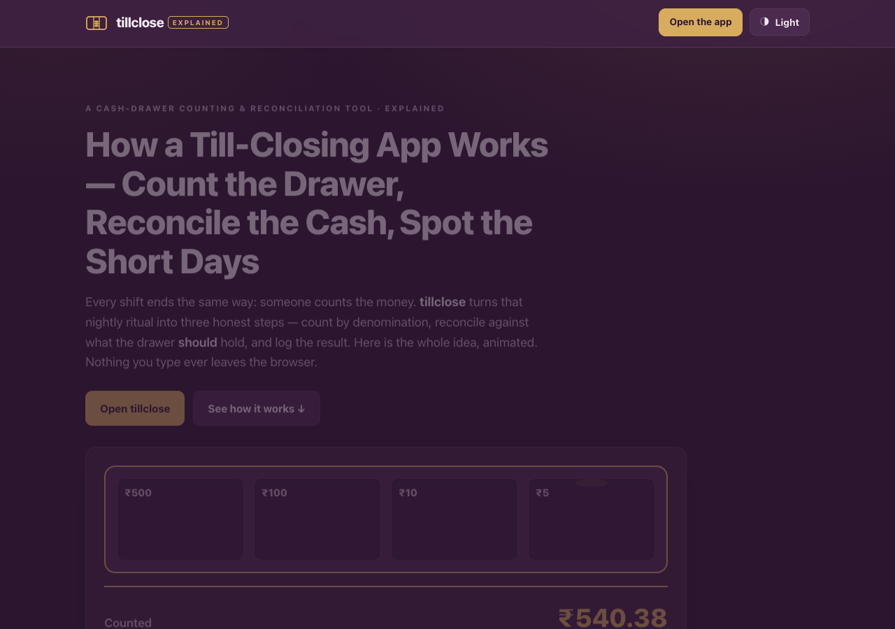

# tillclose · explained

**Count the drawer, catch the shortage, close the day.** A single-page, animated
explainer for [**tillclose**](https://sreenivas-sadhu-prabhakara.github.io/tillclose/) —
the cash denomination calculator and daily till-closing log. This page walks
through the whole idea: the problem with counting cash on paper, the three honest
steps the app performs, and the privacy guarantee the browser *enforces* rather
than promises.

## What this is

This repository is the **explainer site**, a separate deliverable from the app
itself. It is a scroll-driven narrative built with plain HTML, CSS, and a little
vanilla JavaScript — no framework, no libraries, no build step, no network. Its
job is to make the idea behind tillclose land in under a minute and send you to
the live tool.

**→ [Open the tillclose app](https://sreenivas-sadhu-prabhakara.github.io/tillclose/)**

## Why an explainer

Closing a cash till is the same three-step job everywhere — count what is
physically in the drawer, work out what *should* be there, and record the
difference — but it is easy to get wrong on paper and easy to over-build in
software. The explainer shows exactly what tillclose does (and, just as
importantly, what it deliberately does not do) so anyone deciding whether to use
it can see the whole shape at a glance.

## The story it tells

1. **The problem** — paper slips, spreadsheets with no history, and cloud
   counters that want an account for a cash count.
2. **Step one — count the drawer** by denomination; each well shows a subtotal,
   a grand total runs live, all in integer minor units so decimals never drift.
3. **Step two — reconcile:** expected cash = opening float + cash sales − payouts,
   every figure hand-entered.
4. **The verdict** — counted minus expected, stamped **TALLIED / SHORT / OVER** in
   words and colour (never colour alone).
5. **The record** — a dated closing log that makes a pattern of shortages visible.
6. **The guarantee** — a `connect-src 'none'` Content-Security-Policy the browser
   uses to block every network call.
7. **A short feature tour** and a call to action to open the app.

## Design & motion

- Shares the tillclose family identity: **aubergine drawer, soft-gold tally**,
  system-sans type, tabular numerals — so the explainer and the app read as one
  family.
- All animation is **CSS + inline SVG only** (coins dropping into wells, count-up
  tickers, the stamp motif, the CSP "packet blocked at the wall" scene). Nothing
  is fetched.
- Fully **`prefers-reduced-motion` aware**: every animation degrades to a static,
  legible state.
- **WCAG-AA** in both light and dark schemes, keyboard-operable, visible focus
  rings, skip-link, state never encoded by colour alone.

## Quickstart

Open `index.html` in any modern browser — no build step, no server, no install.

- **Local:** double-click `index.html`, or run a static server in the folder.
- **Hosted:** [https://sreenivas-sadhu-prabhakara.github.io/tillclose-explained/](https://sreenivas-sadhu-prabhakara.github.io/tillclose-explained/)

The only thing stored locally is your light/dark theme preference.

## Privacy

- A strict Content-Security-Policy sets `connect-src 'none'`: this page **cannot**
  make any network request even if it tried. The browser enforces it.
- No external fonts, scripts, images, or analytics — everything is self-contained
  and same-origin.
- No accounts, no tracking, no cookies. The page works with no signal at all.

## Disclaimer

This is an explainer page for the tillclose app, provided for general information
only. tillclose is a counting and reconciliation aid and is **not an accounting
system and not financial, tax, audit, or legal advice.** Variance is arithmetic,
not fraud detection — a tallied drawer does not by itself prove correct sales
recording; expected cash is only as accurate as the figures you enter. All amounts
and currencies shown on this page are illustrative examples. Keep your statutory
books separately. This software is provided under the MIT License, "as is",
without warranty of any kind; the authors accept no liability for any loss or
damage arising from its use.

## License

[MIT](./LICENSE) © 2026 Sreenivas Sadhu Prabhakara
